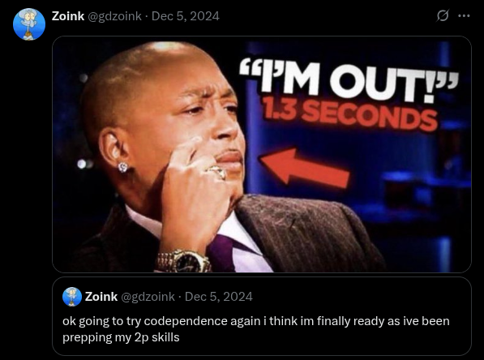
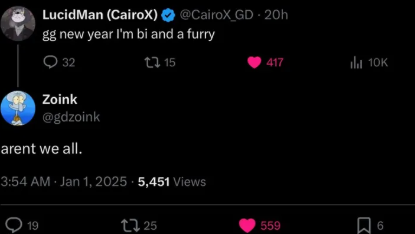
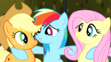
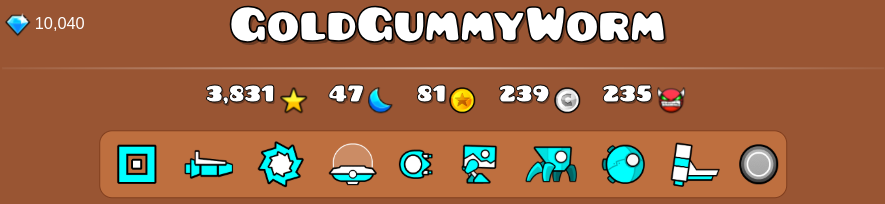

    

<html lang="en">
<head>
  <meta charset="UTF-8">
</head>
<body>
  <h1>

     🌸꧁˜”*°•.˜”*°•🩷 Ｊａｇｅｒ 🩷•°*”˜.•°*”˜꧂🌸
  
</h1>
  

  <a href="#links">Jump to My Links!!</a>

  

<html lang="en">
<head>
  <meta charset="UTF-8">
</head>
<body>
  <h1>

      ✿¸.•❤•.❀•.Ƹ̵̡Ӝ̵̨̄Ʒ Ｉｎｔｒｏｄｕｃｔｉｏｎ Ƹ̵̡Ӝ̵̨̄Ʒ.•❀.•❤•.¸✿
  
</h1>
    

    
     
    
    

    
Heyya ≽^•⩊•^≼ ₊˚⊹♡! my names Jager and im a transgirl 🤍🩷💙 minecraft programmer and generally a computer fanatic 😸 I try to learn all my knowledge by myself via trial and error, so if I know something it means ive messed it up badly before 💔 
heres some (other) interests!;

</body>
</html>

<html lang="en">
<head>
  <meta charset="UTF-8"
</head>
<body>
  <ul>
      

          ╔═════∘◦　^(⑉>▽<⑉)^　◦∘═════╗
      

    <li>⛥ Minecraft & Geometry Dash 🖱️</li>
       
<blockquote>
4,300 hours on GD btw 🥹 my Hardest is Requiem
</blockquote>
              

    

    <li>⛥ Murder Drones!! 💜</li>
      <blockquote>
I got recommend the show awhile ago by a friend and oh she put me ON, I became in love with the whole idea of the show and I became obessed with the characters. Im a die hard Uzi and V fan and they will forever be on somepart of my mind
</blockquote>
              

    

    <li>⛥ Furry Fandom 🐾</li>
      <blockquote>
I love furries sm 💚 one of the fandoms ive interacted with for the longest and its easily my favorite!! the most welcoming community ive ever been in and honestly made me a more creative person by proxy. although despite that I still havent made a sona which GOD DAM I need to tf 💔
</blockquote>
              

    

    <li>⛥ My Little Pony 💛</li>
      <blockquote>
This is probably the most recent fandom I started interacting with but I fell in love with the characters SO FAST! I feel like everyone can describe themselves via one of the mane 6, me personally im a fluttershy gal easily shes so me 😭 (also fluttershy is transfem, argue with a wall)
</blockquote>
              

    

    <li>⛥ Rainbow Six Siege ⌨️</li>
      <blockquote>
quite the curve ball of an interest but even at my youngest ages I loved FPS games, I wasnt actually ment to be introduced to siege but my brother left the disk out on the counter one day and I just shoved into our xbox. from that day ive played for 7 years and its still my favorite FPS game, though my peak is being a 1.6kd Emerald (PC) but I just wanna have fun 🥹
</blockquote>
      

    

    

        ╚═════════∘◦ ✿ ◦∘═════════╝
    

  </ul>
</body>
</html>

    

<html lang="en">
<head>
  <meta charset="UTF-8">
</head>
<body>
  <h1>

      ºO•❤•.¸✿¸.•❤•.❀• Ｇｅｏｍｅｔｒｙ Ｄａｓｈ •❀.•❤•.¸✿¸.•❤•Oº
  
</h1>
</body>
    

     Ive played GD for about 6 years and have played over 4,300 hours (yikes). as of writing ive completed about 18 extreme demons and about 40 insane demons with a overall demon count of about 235. My hardest level is Requiem by Zylenox. Ive also cleared top list challenges SC66p, Im blind (66px2), and my hardest Final Destination by icedcave. I also may or may not have been apart of the creation of SongFileHub :trollface:
  
 
 

     
 

</html>

<html lang="en">
<head>
  <meta charset="UTF-8">
</head>
<body>
  <h1>

      ˜”*°•.˜”*°• Ｍｕｓｉｃ •°*”˜.•°*”˜
  
</h1>
    I actually used to be a freak and didnt listen to much music like at all, but my older brother in the past 3 years has had influence on me and developed me into who I am now (music taste wise). I am a big fan of Hyperpop but ive more moved into experimental/alternative electronic music and hiphop, I actually dont know like anything about genres do not ask me anything I just listen to whatever sounds good 🥹
    
 
    Ƹ̵̡Ӝ̵̨̄Ʒ (Some of) My Favorite Albums & EPs Ƹ̵̡Ӝ̵̨̄Ʒ
    
 
    
 
    
        
        
        
        
        
          
          
          
          
    

     <blockquote>
might add links to them one day if im bored
</blockquote>
</body>
</html>

<html lang="en">
<head>
  <meta charset="UTF-8">
</head>
<body>
    

  <h1>

     ˜”*°•.˜”*°• Ｌｉｎｋｓ •°*”˜.•°*”˜
  
</h1>

      

    
    
    

    

    

  

 

    

